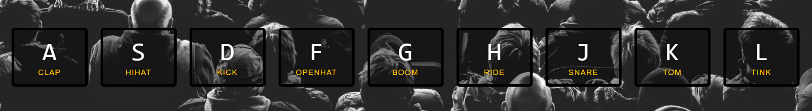

# Day 01 - Drum Kit 🥁

## Description

This project is a virtual drum kit built with HTML, CSS, and JavaScript.  
Each key plays a different drum sound when pressed.

## Features

- Play sounds with keyboard keys (A–L)
- Visual feedback using transitions
- Responsive layout with Flexbox

## Technologies Used

- HTML
- CSS
- JavaScript (DOM events, audio API)

## Screenshot

## How to Run

1. Open `index.html` in your browser
2. Press any of the mapped keys (A, S, D, etc.)

---

🔗 [Back to Main Repo](../README.md)
